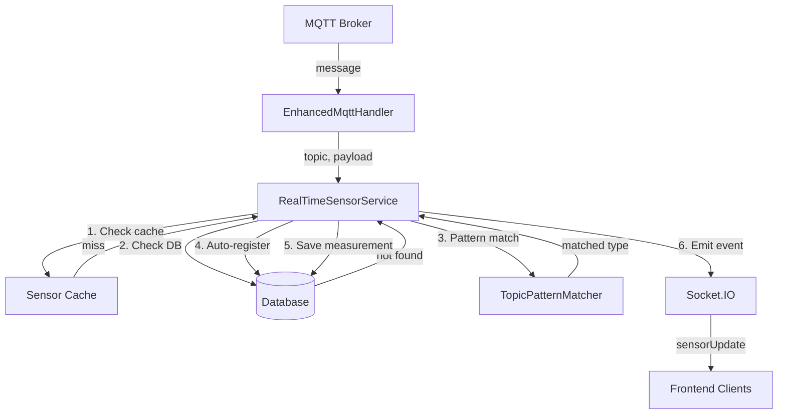

# Design Document: MQTT Sensor Data Fix

## Overview

This design addresses the issue where CO₂ and sonar sensor data is received by the backend but not saved to the database. The root cause is that the `RealTimeSensorService` requires exact topic matches in the database, and topics like "CO2" and "level" may not be pre-registered.

The solution introduces dynamic topic pattern matching and auto-registration of sensors, ensuring all valid sensor data is persisted regardless of whether the topic was pre-configured.

## Architecture



## Components and Interfaces

### 1. TopicPatternMatcher

A new utility class responsible for matching MQTT topics to sensor types using configurable patterns.

```javascript
class TopicPatternMatcher {
    constructor() {
        // Default patterns - can be extended via configuration
        this.patterns = [
            { pattern: /^co2$/i, type: 'co2_level', unit: 'ppm' },
            { pattern: /^co2[_-]?level$/i, type: 'co2_level', unit: 'ppm' },
            { pattern: /^level$/i, type: 'sonar_distance', unit: 'cm' },
            { pattern: /^sonar$/i, type: 'sonar_distance', unit: 'cm' },
            { pattern: /^distance$/i, type: 'sonar_distance', unit: 'cm' },
            { pattern: /^temp(erature)?$/i, type: 'temperature', unit: '°C' },
            { pattern: /^humidity$/i, type: 'humidity', unit: '%' },
            { pattern: /^sugar$/i, type: 'sugar_level', unit: 'brix' },
        ];
    }

    /**
     * Match a topic to a sensor type
     * @param {string} topic - The MQTT topic
     * @returns {object|null} - { type, unit } or null if no match
     */
    match(topic) { ... }

    /**
     * Add a custom pattern
     * @param {RegExp} pattern - The regex pattern
     * @param {string} type - The sensor type code
     * @param {string} unit - The measurement unit
     */
    addPattern(pattern, type, unit) { ... }
}
```

### 2. Enhanced RealTimeSensorService

The existing service will be enhanced with:
- Pattern matching fallback when database lookup fails
- Auto-registration of new sensors
- Improved logging throughout the data flow

```javascript
class RealTimeSensorService {
    constructor(io) {
        this.io = io;
        this.sensorCache = new Map();
        this.patternMatcher = new TopicPatternMatcher();
        // ... existing properties
    }

    /**
     * Handle sensor data with fallback to pattern matching
     * @param {string} topic - MQTT topic
     * @param {string} payload - Message payload
     * @returns {boolean} - true if handled successfully
     */
    async handleSensorData(topic, payload) {
        // 1. Try cache/DB lookup (existing logic)
        // 2. If not found, try pattern matching
        // 3. If pattern matches, auto-register sensor
        // 4. Save measurement
        // 5. Emit to frontend
    }

    /**
     * Auto-register a sensor based on pattern match
     * @param {string} topic - MQTT topic
     * @param {object} matchResult - { type, unit }
     * @returns {object} - The created sensor record
     */
    async autoRegisterSensor(topic, matchResult) { ... }
}
```

### 3. Database Schema Requirements

The solution uses existing tables but requires a default user/room for auto-registered sensors:

```sql
-- Ensure a default system user exists for auto-registered sensors
INSERT IGNORE INTO users (id, username, email, role) 
VALUES (1, 'system', 'system@localhost', 'system');

-- Ensure a default room exists
INSERT IGNORE INTO rooms (id, user_id, room_code, room_name, is_active)
VALUES (1, 1, 'default', 'Default Room', 1);
```

## Data Models

### Sensor Configuration (from database)

```javascript
{
    id: number,
    sensor_name: string,
    mqtt_topic: string,
    sensor_type_id: number,
    type_code: string,      // e.g., 'co2_level', 'sonar_distance'
    type_name: string,      // e.g., 'CO2 Level', 'Sonar Distance'
    unit: string,           // e.g., 'ppm', 'cm'
    user_id: number,
    room_id: number,
    room_code: string,
    room_name: string,
    is_active: boolean
}
```

### Pattern Match Result

```javascript
{
    type: string,           // Sensor type code
    unit: string,           // Measurement unit
    pattern: RegExp,        // The matched pattern
    specificity: number     // Pattern specificity score
}
```

### Measurement Record

```javascript
{
    id: number,
    sensor_id: number,
    measured_value: number,
    measured_at: Date,
    quality_indicator: number
}
```

## Correctness Properties

*A property is a characteristic or behavior that should hold true across all valid executions of a system—essentially, a formal statement about what the system should do. Properties serve as the bridge between human-readable specifications and machine-verifiable correctness guarantees.*

### Property 1: Numeric Payload Parsing

*For any* MQTT topic and numeric payload string, the Sensor_Service SHALL successfully parse the value and return a finite number.

**Validates: Requirements 2.1, 3.1**

### Property 2: Measurement Persistence Round-Trip

*For any* valid sensor topic and numeric value, after the Sensor_Service processes the data, querying the sensor_measurements table SHALL return a record with the same value (within floating-point tolerance).

**Validates: Requirements 2.2, 3.2**

### Property 3: Invalid Payload Rejection

*For any* non-numeric payload (including empty strings, text, special characters), the Sensor_Service SHALL NOT create a measurement record and SHALL return false.

**Validates: Requirements 2.3, 3.3**

### Property 4: Case-Insensitive Topic Matching

*For any* topic string and its case variations (uppercase, lowercase, mixed), the TopicPatternMatcher SHALL return the same sensor type match.

**Validates: Requirements 4.2**

### Property 5: Pattern Specificity Ordering

*For any* topic that matches multiple patterns, the TopicPatternMatcher SHALL return the pattern with the highest specificity score (longer/more specific patterns win).

**Validates: Requirements 4.3**

### Property 6: Auto-Registration Idempotence

*For any* unregistered topic, calling autoRegisterSensor multiple times with the same topic SHALL result in exactly one sensor record in the database.

**Validates: Requirements 1.3**

### Property 7: Socket.IO Event Emission

*For any* successfully saved measurement, the Sensor_Service SHALL emit exactly one 'sensorUpdate' event containing the sensor_id, value, and timestamp.

**Validates: Requirements 2.4, 3.4**

### Property 8: Database Retry Behavior

*For any* transient database failure during sensor lookup, the Sensor_Service SHALL retry up to 3 times before failing, with each retry occurring after an exponential backoff delay.

**Validates: Requirements 5.1**

## Error Handling

### Invalid Payload Handling

```javascript
// When payload cannot be parsed as a number
const value = parseFloat(payload);
if (!Number.isFinite(value)) {
    console.warn(`⚠️ [${topic}] Invalid payload: "${payload}" - skipping`);
    return false;
}
```

### Database Connection Failures

```javascript
// Retry with exponential backoff
async function withRetry(operation, maxRetries = 3) {
    for (let attempt = 1; attempt <= maxRetries; attempt++) {
        try {
            return await operation();
        } catch (error) {
            if (attempt === maxRetries) {
                console.error(`❌ Operation failed after ${maxRetries} attempts:`, error.message);
                throw error;
            }
            const delay = Math.pow(2, attempt) * 100; // 200ms, 400ms, 800ms
            await new Promise(r => setTimeout(r, delay));
        }
    }
}
```

### Unmatched Topic Handling

```javascript
// When topic doesn't match any pattern
if (!matchResult) {
    console.warn(`⚠️ [${topic}] No pattern match - topic not recognized`);
    console.warn(`   Payload: "${payload}"`);
    console.warn(`   Consider adding a pattern for this topic type`);
    return false;
}
```

## Testing Strategy

### Unit Tests

Unit tests will verify specific examples and edge cases:

1. **TopicPatternMatcher tests**
   - Test each default pattern matches expected topics
   - Test case variations (CO2, co2, Co2)
   - Test non-matching topics return null
   - Test custom pattern addition

2. **RealTimeSensorService tests**
   - Test cache hit scenario
   - Test database lookup scenario
   - Test pattern matching fallback
   - Test auto-registration flow
   - Test measurement saving
   - Test Socket.IO emission

### Property-Based Tests

Property-based tests will use fast-check to verify universal properties:

```javascript
const fc = require('fast-check');

// Property 1: Numeric parsing
fc.assert(
    fc.property(fc.float(), (value) => {
        const payload = value.toString();
        const parsed = parseFloat(payload);
        return Number.isFinite(parsed) && Math.abs(parsed - value) < 0.0001;
    })
);

// Property 4: Case-insensitive matching
fc.assert(
    fc.property(fc.constantFrom('co2', 'CO2', 'Co2', 'cO2'), (topic) => {
        const matcher = new TopicPatternMatcher();
        const result = matcher.match(topic);
        return result !== null && result.type === 'co2_level';
    })
);
```

### Integration Tests

Integration tests will verify end-to-end data flow:

1. Publish MQTT message → Verify database record created
2. Publish to unregistered topic → Verify auto-registration and measurement
3. Publish invalid payload → Verify no database record created
4. Simulate database failure → Verify retry behavior

### Test Configuration

- Property-based tests: minimum 100 iterations per property
- Test framework: Jest with fast-check for property testing
- Each property test tagged with: **Feature: mqtt-sensor-data-fix, Property N: {property_text}**
